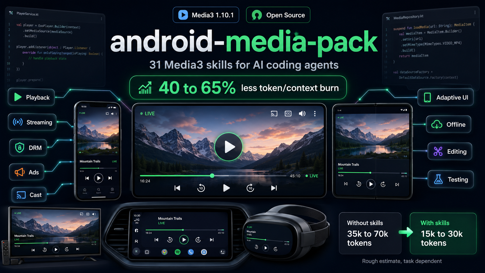

# android-media-pack

Current versions: **android-media-pack v2.0.0** · **Media3 1.10.1**

[](LICENSE)
[](https://developer.android.com/jetpack/androidx/releases/media3)



Media skills for AI coding agents building Android and Kotlin Multiplatform media features with **AndroidX Media3 1.10.1**.

Use this pack when you want an agent to change real media code without guessing from stale ExoPlayer examples, old blog posts, or generic Android advice.

## What You Get

31 focused skills for the work media apps usually need:

| Area | Use it for |
|---|---|
| Architecture | KMP boundaries, player ownership, feeds, preload windows, offline-first data, telemetry contracts |
| Migration | ExoPlayer 2.x to Media3, XML `PlayerView` to Compose UI |
| Playback | video, audio, VOD, background playback, lifecycle state |
| Streaming and protocols | HLS, DASH, SmoothStreaming, RTSP, MIDI, live, live-only streams, buffer policy |
| Delivery | DataSource, HTTP stacks, cache, bandwidth, ABR, Cast |
| UI and devices | Compose, Views, adaptive layouts, phones, tablets, foldables, TV, Auto, XR |
| Protection | Widevine, license headers, offline licenses, HDCP and L1/L3 behavior |
| Ads and analytics | IMA CSAI/SSAI, ad UI, QoE telemetry, TTFF, rebuffer, dropped frames |
| Inspection | metadata, thumbnails, frame extraction, container checks |
| Processing and tests | Transformer, effects, Lottie, muxer, test utilities, Robolectric |

All skills are short, current, and task-shaped. They tell the agent what to inspect, what to avoid, and which Media3 APIs belong in Android source sets instead of `commonMain`.

## Why Skills Help

Without this pack, an agent often burns context on broad search and mixed-era examples.

| Task | Without skills | With this pack |
|---|---|---|
| Migrate ExoPlayer | Agent may mix `com.google.android.exoplayer2.*` with `androidx.media3.*` and chase old migration snippets. | `migrate-exoplayer-to-media3` gives the package boundary and current Media3 target first. |
| Build Compose player UI | Agent may wrap old `PlayerView` in `AndroidView` by default. | `media3-compose-ui-material3` points at Media3 Compose UI, `ContentFrame`, player controls, and lifecycle-safe state. |
| Make UI responsive | Agent may stretch a phone player across tablets, foldables, TV, Auto, or XR. | Adaptive and device skills split mobile/tablet/foldable UI from TV, Auto, and XR constraints. |
| Build reels or short-feed playback | Agent may create a player per row or preload too much. | `streaming-media-architecture` sets one owner, a bounded window, thumbnail handoff rules, and telemetry gates. |
| Add HLS/DASH playback | Agent may treat live and VOD the same. | Streaming skills split HLS/DASH, live, live-only, VOD, ABR, and manifest failure handling. |
| Add DRM or ads | Agent may hide errors behind generic playback failures. | Protection and ads skills keep license/ad errors separate from content errors and telemetry. |

This is not magic. It is better context. The agent starts closer to the right architecture, which means less token burn, fewer wrong paths, and less cleanup.

## Latest Media3 Baseline

The pack targets **Media3 1.10.1**, released May 12, 2026 in the official AndroidX Media3 release notes. That release includes fixes and API movement relevant to playback, extractors, inspector frame extraction, and Media3 Compose UI.

Primary source: [AndroidX Media3 release notes](https://developer.android.com/jetpack/androidx/releases/media3).

## Install

The repository stores source skills under `.skills/media/`. The installer flattens them into the folder your agent actually reads.

Default target:

```text
your-android-project/.agents/skills/<skill-name>/SKILL.md
```

Install with the CLI:

```bash
curl -fsSL https://raw.githubusercontent.com/sunnat629/android-media-pack/main/bin/android-media-skill \
  -o android-media-skill
chmod +x android-media-skill
./android-media-skill install /path/to/your-android-project
```

Common commands:

```bash
./android-media-skill install /path/to/project
./android-media-skill update /path/to/project
./android-media-skill list /path/to/project
./android-media-skill doctor /path/to/project
```

Install into a specific agent folder:

```bash
MEDIA_SKILLS_DEST=.claude/skills ./android-media-skill install /path/to/project
MEDIA_SKILLS_DEST=.cursor/skills ./android-media-skill install /path/to/project
MEDIA_SKILLS_DEST=.gemini/skills ./android-media-skill install /path/to/project
```

One-line install:

```bash
cd your-android-project
curl -fsSL https://raw.githubusercontent.com/sunnat629/android-media-pack/main/scripts/install-media-skills.sh \
  | bash -s -- . https://github.com/sunnat629/android-media-pack main
```

The installer replaces matching media skill folders in the destination. It does not delete unrelated skills.

## Agent Paths

| Agent | Project-local target |
|---|---|
| GitHub Copilot, OpenCode, Gemini CLI, OpenAI Codex | `.agents/skills/<skill-name>/SKILL.md` |
| Claude Code | `.claude/skills/<skill-name>/SKILL.md` |
| Cursor | `.cursor/skills/<skill-name>/SKILL.md` |
| Gemini CLI | `.gemini/skills/<skill-name>/SKILL.md` |
| Junie | `.junie/skills/<skill-name>/SKILL.md`, then reference them from `.junie/guidelines.md` |

## Use

Ask naturally:

```text
Migrate this project from ExoPlayer 2.x to Media3.
```

```text
Build a Compose Media3 video player screen with proper lifecycle handling.
```

```text
Design a reels feed player architecture for KMP with bounded preloading.
```

The agent should load the matching skill and use it as task context.

## Skills

| Skill | Best first use |
|---|---|
| [`streaming-media-architecture`](.skills/media/streaming-media-architecture/SKILL.md) | Start here for KMP, feeds, ownership, preload, architecture |
| [`migrate-exoplayer-to-media3`](.skills/media/migration/migrate-exoplayer-to-media3/SKILL.md) | Replace legacy ExoPlayer packages and APIs |
| [`migrate-xml-ui-to-compose`](.skills/media/migration/migrate-xml-ui-to-compose/SKILL.md) | Move XML player UI to Compose |
| [`media3-background-playback-service`](.skills/media/background/media3-background-playback-service/SKILL.md) | MediaSessionService, notification, media buttons |
| [`media3-lifecycle-state`](.skills/media/background/media3-lifecycle-state/SKILL.md) | MediaController lifecycle, saved state, process death |
| [`media3-compose-ui-material3`](.skills/media/ui/media3-compose-ui-material3/SKILL.md) | Media3 Compose UI and Material3 controls |
| [`media3-adaptive-compose-ui`](.skills/media/ui/media3-adaptive-compose-ui/SKILL.md) | Responsive Compose UI across phones, tablets, foldables, and large screens |
| [`media3-view-ui-player`](.skills/media/ui/media3-view-ui-player/SKILL.md) | Android Views `PlayerView`, XML UI, and Compose interop |
| [`media3-tv-leanback-ui`](.skills/media/ui/media3-tv-leanback-ui/SKILL.md) | Android TV Leanback UI, D-pad focus, overscan-safe controls |
| [`media3-android-auto-media-surface`](.skills/media/ui/media3-android-auto-media-surface/SKILL.md) | Android Auto media sessions, browse trees, transport controls |
| [`media3-xr-media-surface`](.skills/media/ui/media3-xr-media-surface/SKILL.md) | Android XR media surface planning, immersive UI, current-doc checks |
| [`media3-video-playback`](.skills/media/playback/media3-video-playback/SKILL.md) | Surfaces, aspect ratio, first frame, HDR, PiP |
| [`media3-audio-playback`](.skills/media/playback/media3-audio-playback/SKILL.md) | Audio focus, attributes, becoming-noisy, session controls |
| [`media3-vod-playback`](.skills/media/playback/media3-vod-playback/SKILL.md) | Resume, playlists, chapters, thumbnails |
| [`media3-rtsp-playback`](.skills/media/playback/media3-rtsp-playback/SKILL.md) | RTSP camera feeds, LAN streams, reconnect, credential-safe errors |
| [`media3-smoothstreaming-playback`](.skills/media/playback/media3-smoothstreaming-playback/SKILL.md) | SmoothStreaming manifests and adaptive playback caveats |
| [`media3-midi-playback`](.skills/media/playback/media3-midi-playback/SKILL.md) | MIDI playback dependency checks and generated-audio caveats |
| [`media3-hls-dash-adaptive-streaming`](.skills/media/streaming/media3-hls-dash-adaptive-streaming/SKILL.md) | Adaptive streaming, manifests, subtitles, buffering |
| [`media3-live-streaming`](.skills/media/streaming/media3-live-streaming/SKILL.md) | Live offset, DVR, catch-up, reconnect |
| [`media3-live-only-streaming`](.skills/media/streaming/media3-live-only-streaming/SKILL.md) | Non-DVR streams with no seeking or resume |
| [`media3-datasources-networking`](.skills/media/delivery/media3-datasources-networking/SKILL.md) | HTTP, cache, headers, auth, custom DataSource |
| [`media3-bandwidth-abr`](.skills/media/delivery/media3-bandwidth-abr/SKILL.md) | Bandwidth, ABR limits, load control |
| [`media3-cast-integration`](.skills/media/delivery/media3-cast-integration/SKILL.md) | CastPlayer and local-to-remote handoff |
| [`media3-workmanager-offline-ops`](.skills/media/background/media3-workmanager-offline-ops/SKILL.md) | WorkManager-backed offline operations, constraints, retries, cleanup |
| [`media3-drm-widevine-setup`](.skills/media/protection/media3-drm-widevine-setup/SKILL.md) | Widevine, licenses, HDCP, L1/L3 |
| [`media3-ads-ima`](.skills/media/ads-analytics/media3-ads-ima/SKILL.md) | IMA CSAI/SSAI ads and companion UI |
| [`media3-analytics-telemetry`](.skills/media/ads-analytics/media3-analytics-telemetry/SKILL.md) | QoE, TTFF, rebuffer, dropped frames, player errors |
| [`media3-inspector-metadata-thumbnails`](.skills/media/inspector/media3-inspector-metadata-thumbnails/SKILL.md) | Metadata, thumbnails, frame/container inspection |
| [`media3-transformer-editing`](.skills/media/processing/media3-transformer-editing/SKILL.md) | Transformer trim, transcode, export jobs, progress, cancellation |
| [`media3-video-effects-lottie-muxer`](.skills/media/processing/media3-video-effects-lottie-muxer/SKILL.md) | Video effects, Lottie overlays, muxing, export boundaries |
| [`media3-test-utils-robolectric`](.skills/media/testing/media3-test-utils-robolectric/SKILL.md) | Media3 test utilities, Robolectric patterns, fake playback state |

## Sample App

`sampleApp/` is a Compose Material3 demo app with a large Media3 Compose video surface, HLS and DASH sample streams, playback controls, a progress bar, and a compact skills summary. The full skill list is behind the top info button so the home screen stays focused on playback.

Run it from the repository root:

```bash
./run-sample-app.sh --serial <device-serial>
```

## Related

Complements [android/skills](https://github.com/android/skills). Same `SKILL.md` format. Prefer canonical `android/skills` when a skill exists in both.

## Docs

[Changelog](CHANGELOG.md) · [Compatibility](COMPATIBILITY.md) · [Contributing](CONTRIBUTING.md) · [References](REFERENCES.md) · [Security](SECURITY.md) · [Code of Conduct](CODE_OF_CONDUCT.md)

Questions go to [Discussions](https://github.com/sunnat629/android-media-pack/discussions). Bugs go to [Issues](https://github.com/sunnat629/android-media-pack/issues/new/choose).

## License

[Apache License 2.0](LICENSE). Copyright 2026 Shunnek Labs and contributors.
